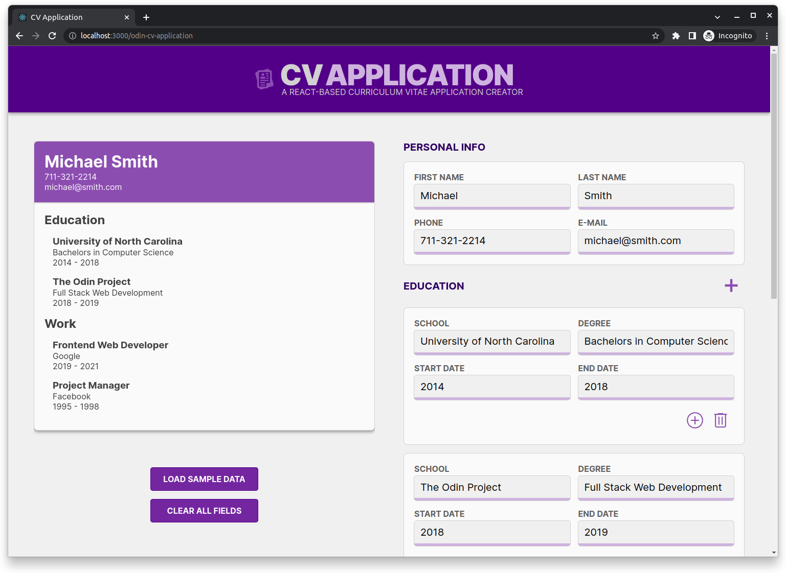
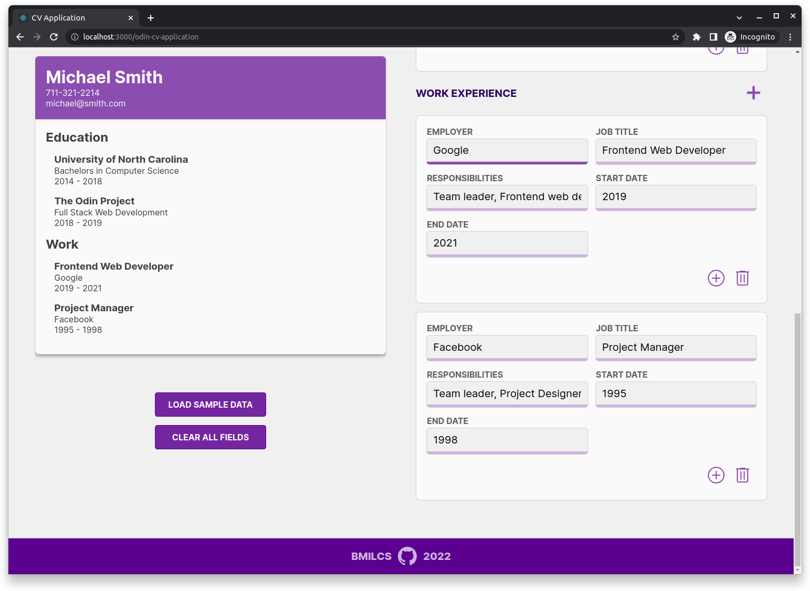
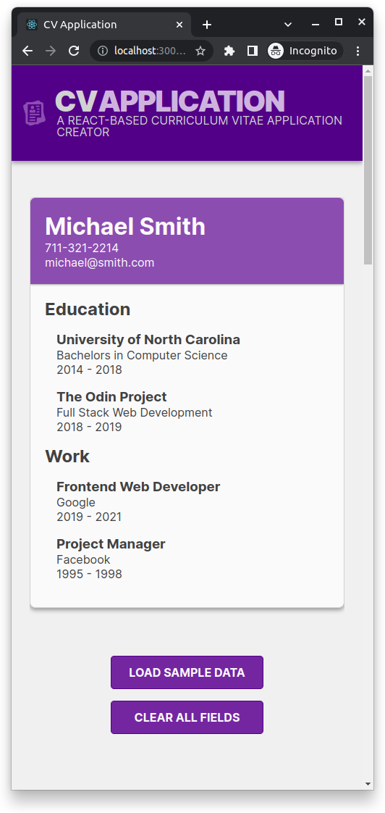
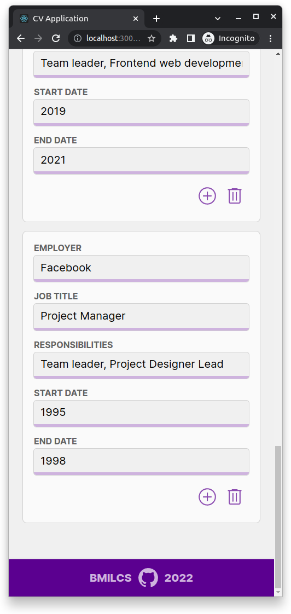

# Odin Project #19: CV Application

Welcome to Bryan Miller's CV Application Project, the [nineteenth assignment](https://www.theodinproject.com/lessons/node-path-javascript-cv-application) within the Odin Project curriculum. The goal of this repo is to practice the following skill sets:

- React (first introduction)
  - `create-react-app`
  - Class Components
  - Props & State
- Git Feature Branches & Merging

## Summary

As much as I enjoy writing Vanilla JavaScript, React is an invaluable addition to my web development tool kit. The Odin Project's introduction to React covered state and props, which allow us to pass around data, functions and even components throughout our web applications. React's super power comes in the form of dynamic rendering. In other words, when our state changes, React efficiently updates and renders the changes to the DOM automatically.

The CV Application project provided the perfect opportunity to get a feel for the React way of doing things. It illustrated the importance of storing state in the parent most component and passing state to child components through the prop system. By doing so, all changes made to state have a ripple effect across all child components that are tied to its data.

Here is how I tackled this assignment from a high level overview:

### **State & Form Data**

The `App` component (`src/App.js`) is the star of the show in this project. It controls the state of the entire application.

For presentation purposes, state is initialized with sample data within the `App` component's constructor:

```js
class App extends React.Component {
  constructor(props) {
    super(props);
    this.state = { ...sampleData };
  }

  // Note: The 'Clear All Fields' button sets state to the emptyForm object
  // and 'Load Sample Data' button sets state to the sampleData object.

  handleClearAllFields = () => {
    this.setState({ ...emptyForm });
  };

  handleLoadSampleData = () => {
    this.setState({ ...sampleData });
  };
}
```

However, the `emptyForm` module contains the primary data structure for the application. Every input element in the app has an `onChange` attribute that points to its corresponding property in the App's state object. As a result, every single time a text field is changed by the user (or the Clear All Fields or Load Sample Data buttons are pressed), the `Preview` module renders those changes automatically. (React is awesome!)

```js
const emptyForm = {
  personal: {
    firstName: "",
    lastName: "",
    email: "",
    phone: "",
  },
  education: [],
  work: [],
};

// Factories for work & education objects

const WorkItem = () => {
  return {
    id: uniqid(),
    employer: "",
    title: "",
    responsibilities: "",
    startDate: "",
    endDate: "",
  };
};

const EducationItem = () => {
  return {
    id: uniqid(),
    school: "",
    degree: "",
    startDate: "",
    endDate: "",
  };
};
```

### Room for Improvement

If I were to recreate this project with the experience I now have, I would have segmented the buttons into their own components and changed the way they are identified by their corresponding event handler functions.

For example, the `+` Education & Work buttons rely on the html `id` attribute and splitting its value into an array, which is not ideal. I should have opted for `dataset` attributes to make it easier to read and understand for other developers.

The way I organized the project, including the folder structure, isn't great. Considering that this was my first introduction to React, I treated this project as more of a playground or sandbox to learn in, rather than a production ready piece of software. In the interest of moving forward, I am settling on a working first draft. All in all, this was a great learning experience and I will take these lessons into future projects.

## Screenshots

> Desktop
>  >  >  > 

## Links

- [Live Demo](https://bmilcs.github.io/odin-cv-application/)
- [My Odin Project Progress](https://github.com/bmilcs/odin-project)

## Deployment

```sh
# clone repo
git clone https://github.com/bmilcs/odin-cv-application

# dependencies
npm install uniqid
```
